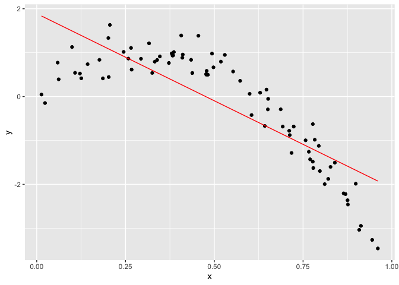
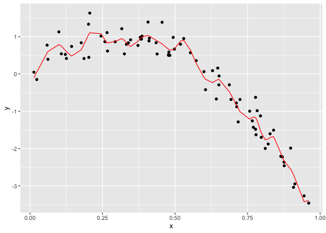

cross_validation
================
2022-11-15

## Step one

Cross validation “by hand” on simulated data.

``` r
nonlin_df = 
  tibble(
    id = 1:100,
    x = runif(100, 0, 1),
    y = 1 - 10 * (x - .3) ^ 2 + rnorm(100, 0, .3)
  )

nonlin_df %>% 
  ggplot(aes(x = x, y = y)) + 
  geom_point()
```

<!-- -->

Let’s get this by hand.

``` r
train_df = sample_n(nonlin_df, 80)
test_df = anti_join(nonlin_df, train_df, by = "id")
```

``` r
train_df %>%
  ggplot(aes(x = x, y = y)) + 
  geom_point() +
  geom_point(data = test_df, color = "red")
```

<!-- -->

Let’s try to fit three models.

``` r
linear_mod = lm(y ~ x, data = train_df)
smooth_mod = mgcv::gam(y ~ s(x), data = train_df)
wiggly_mod = mgcv::gam(y ~ s(x, k = 30), sp = 10e-6, data = train_df)
```

Let’s see the results.

``` r
train_df %>%
  add_predictions(linear_mod) %>%
  ggplot(aes(x = x , y = y)) +
  geom_point() +
  geom_line(aes(y = pred), color = "red")
```

<!-- -->

``` r
train_df %>%
  add_predictions(smooth_mod) %>%
  ggplot(aes(x = x , y = y)) +
  geom_point() +
  geom_line(aes(y = pred), color = "red")
```

<!-- -->

``` r
train_df %>%
  add_predictions(wiggly_mod) %>%
  ggplot(aes(x = x , y = y)) +
  geom_point() +
  geom_line(aes(y = pred), color = "red")
```

<!-- -->

How to pick which model is the best? Use cross validation.

Let’s make predictions and compute RMSEs.

``` r
rmse(linear_mod, test_df)
```

    ## [1] 0.7052956

``` r
rmse(smooth_mod, test_df)
```

    ## [1] 0.2221774

``` r
rmse(wiggly_mod, test_df)
```

    ## [1] 0.289051

Smooth model is better (lower RMSE = more accurate prediction).

## Can we iterate …?

``` r
cv_df = 
  crossv_mc(nonlin_df, 100) %>%
  mutate(
    train = map(train, as_tibble),
    test = map(test, as_tibble)
  ) %>%
  mutate(
    linear_fits = map(.x = train, ~lm(y ~ x, data = .x))
  )
```
